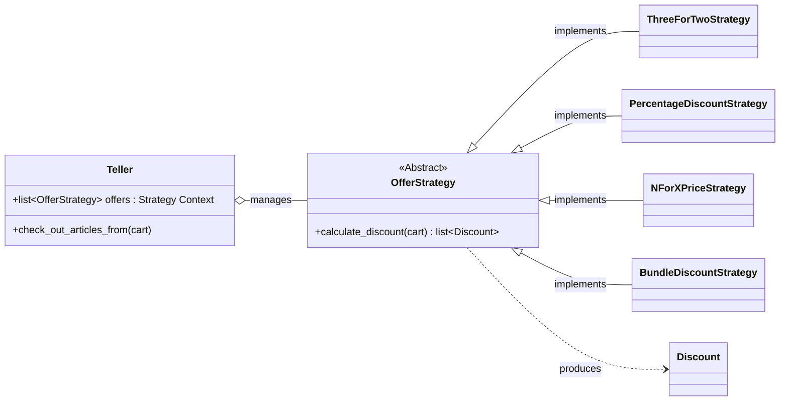
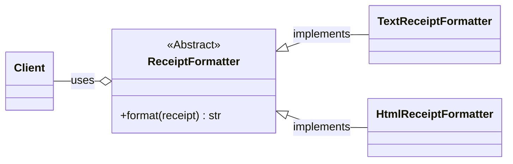

# Supermarket Receipt Refactoring Design

### 1. Architectural Intent: Enhancing Extensibility and Stability
This document outlines the architectural decisions for the Python Supermarket Receipt system. The core design philosophy centers on the Strategy Design Pattern to achieve extensible code. This separation is applied to two primary areas of business logic: Discount Calculation and Receipt Presentation.

The goal is to ensure the system can easily accommodate new business rules (new discount types) and new output formats (e.g., HTML receipts) without modifying existing, tested code.

### 2. Strategy Pattern for Special Offer Management
Special offers represent pure business logic that is prone to frequent change and expansion. The Strategy Pattern decouples the "what" (the discount rule) from the "how" (the process of applying all discounts).

#### 2.1. Design Justification
Extensibility: New special offer types can be introduced by simply creating a  strategy class without altering the core Teller.

Testability: Each offer rule is isolated in its own class, allowing for straightforwrd, and focsued unit testing without needing a full system setup.

#### 2.2. Discount Calculation Structure
The Teller acts as the Context, managing a collection of independent OfferStrategy implementations.

### 3. Strategy Pattern for Receipt Presentation
The presentation of the receipt (i.e., generating the final output string) is separate from the calculation of the data within the receipt. The Strategy Pattern ensures Separation of Concerns between Data and Format.

#### 3.1. Design Justification
Separation of Concerns: The Receipt object focuses on holding the calculated data (subtotals, line items), while the ReceiptFormatter focuses entirely on rendering that data.

Extensibility: New special printing types can be introduced by simply creating a  strategy class without altering the core printer.

Testability: Each printer rule is isolated in its own class, allowing for straightforwrd, and focsued unit testing without needing a full system setup.

3.2. Receipt Presentation Structure
The client code (where the receipt is generated) will instantiate a specific formatter and pass the final Receipt data to it.

